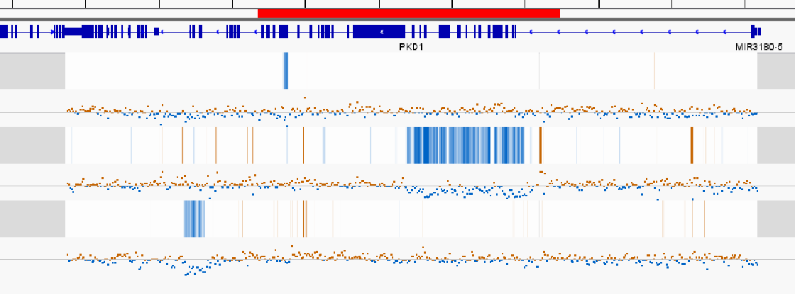

.. iscard documentation master file, created by
   sphinx-quickstart on Wed Jan 22 16:12:21 2020.
   You can adapt this file completely to your liking, but it should at least
   contain the root `toctree` directive.

Welcome to iscard's documentation!
==================================

Iscard is a tool to help detecting `Copy Number Variation <https://en.wikipedia.org/wiki/Copy-number_variation>`_ from Next Generation Sequencing. It works by computed 2 models from normal training sample:    

* **inter-model** computes the sample depth deviation from a normal distribution obtained from the training data set. 

* **intra-model** computes the depth correlation of different position within a sample which follows a linear regression. Those correlations are obtained from the training data. 
  
After creating your model, you can test a sample against and get differents metrics like **z-scores** which describe the deviation from a model. CNV can then be call using these metrics or  displayed in a genome browser like IGV.

   The figure above display 3 samples with CNV each at different sizes. Each sample comes with 2 tracks described inter-model and intra-model z-score.

  

  

.. toctree::
   :maxdepth: 2

   quickstart
   installation
   iscard

   

   ...

Indices and tables
==================

* :ref:`genindex`
* :ref:`modindex`
* :ref:`search`

