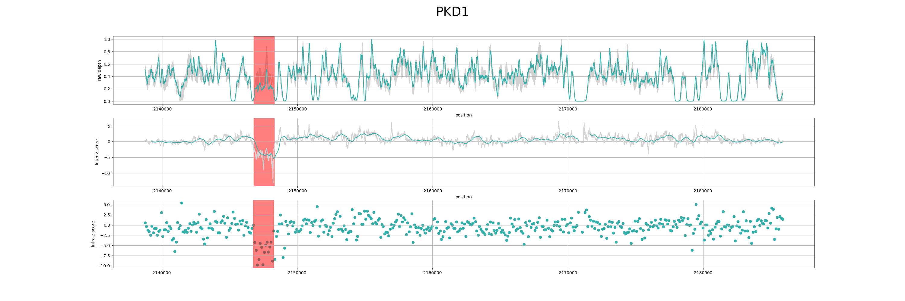

Quickstart
===========================

Iscard is a python package depending version 3.6 or above

.. warning:: Iscard is under developement 

Installation 
------------

Install your package using pip or conda as it is explained on `installation`_ ::

  pip install iscard

Creating the model 
-----------------

Suppose you have all normal sample bam file under the *normal* folder and a region.bed describing
your capture region. 
The bed file must be a 4 columns text file whith chromosom, start, end and name. 

To create the model, type the following command

.. code-block:: language

    iscard learn -i normal/*.bam -r region.bed -o model.h5  

All model data are stored into a hdf5 file. You can check information about your model by 
using info command line 

 .. code-block:: language

    iscard info -m model.h5

    Model version: 0.0.4.dev0
	Depth position counts: 385915
	bedfile: /pkd/panel.bed
	sample rate: 100
	Bam(s) used: 2
	         - /pkd/dataset/tiny/sample1.bam
	         - /pkd/pkd/dataset/tiny/sample2.bam
	Group names(s): 14
	         - CTRC
	         - PKD2
	         - SPINK1
	         - PKHD1
	         - SEC63
	         - CFTR
	         - CFTR-AS1
	         - GANAB
	         - LRP5
	         - PKD1
	         - UMOD
	         - HNF1B
	         - PRKCSH
	         - ADGRG2
	Inter model shape: (385915, 5)
	Intra model shape: (3860, 5)

Test a sample
-------------

After the model has been created, test a sample against the model

.. code-block:: bash

    iscard test -i sample.bam -m model.h5 -o test.result

Plot results
------------

Plot results as svg or png file as follow : 

.. code-block:: bash

    iscard plot -i test.result -m model.h5 -o plot.png	

   Visualization of inter and intra z-score in PKD1 gene. The picture show a deletion mark in red. 

.. warning:: Calling is comming .... 

	iscard call -i test.result -m model.h5 > result.bed

Visualizing results
-------------------

You can create quickly create a `bedgraph <http://genome.ucsc.edu/goldenPath/help/bedgraph.html>`_ from command line
to display CNV in IGV. 

.. code-block:: bash

    iscard bedgraph -i test.result -c inter_z > interz.bedgraph

